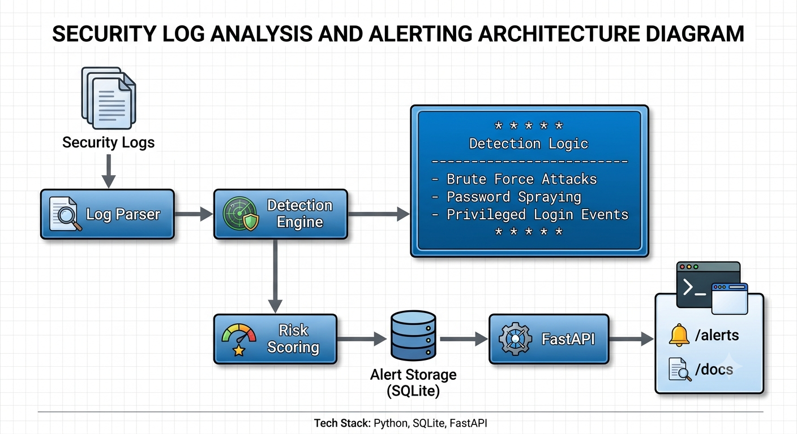

\# SentinelSOC 🛡️


A Python-based Security Operations Center (SOC) monitoring system that analyzes security logs, detects suspicious authentication activity, calculates risk levels, and stores security alerts.


\## 🎯 Project Overview


SentinelSOC is a lightweight security monitoring project designed to demonstrate core SOC concepts using Python.


The system processes security events and applies detection rules to identify suspicious activity such as repeated failed login attempts and password spraying.


Detected events are assigned a risk level and stored as security alerts.


\## ✨ Features


\* 🔍 Security log parsing

\* 🚨 Suspicious login detection

\* 🔐 Brute-force login detection

\* 🔑 Password spraying detection

\* 📊 Risk-based alert classification

\* 💾 SQLite alert storage

\* 🌐 FastAPI REST API

\* 📖 Automatic API documentation

\* 🧪 Test structure for future automated tests

\* 🛡️ Git-safe configuration with sensitive/generated files excluded


## 🏗️ Architecture



SentinelSOC processes security logs through a detection pipeline that parses events, applies detection rules, calculates risk, stores alerts, and exposes results through a FastAPI REST API.

\## 🏗️ Project Structure


```text

SentinelSOC/

│

├── app/

│   ├── core/

│   │   ├── parser.py

│   │   └── risk.py

│   │

│   ├── detectors/

│   │   ├── bruteforce.py

│   │   └── rules.py

│   │

│   ├── storage/

│   │   └── database.py

│   │

│   └── api.py

│

├── tests/

│

├── main.py

├── .gitignore

└── README.md

```


\## ⚙️ Technologies


\* Python

\* FastAPI

\* Uvicorn

\* SQLite

\* REST API

\* Git \& GitHub


\## 🚀 Installation


Clone the repository:


```bash

git clone https://github.com/Fuzzy4-arch/SentinelSOC.git

cd SentinelSOC

```


Install the required dependencies:


```bash

py -m pip install fastapi uvicorn

```


\## ▶️ Run SentinelSOC


Run the security monitoring engine:


```bash

py main.py

```


Run the FastAPI server:


```bash

py -m uvicorn app.api:app --reload

```


The API will be available at:


```text

http://127.0.0.1:8000

```


\## 📡 API


\### Home


```text

GET /

```


Returns the SentinelSOC service status.


\### Alerts


```text

GET /alerts

```


Returns detected security alerts.


\### Interactive API Documentation


FastAPI automatically provides interactive documentation:


```text

http://127.0.0.1:8000/docs

```


\## 🚨 Detection Examples


SentinelSOC currently demonstrates detection logic for suspicious authentication activity including:


\### Brute Force Login


Multiple failed login attempts from the same source can trigger a:


```text

BRUTE\_FORCE\_LOGIN

```


alert.


Example:


```text

\[HIGH] BRUTE\_FORCE\_LOGIN | 192.168.1.20 | admin | attempts=3

```


\### Password Spraying


The project also contains detection logic for:


```text

PASSWORD\_SPRAYING

```


which focuses on multiple accounts being targeted from a common source.


\## 📊 Risk Levels


Alerts are evaluated using risk scoring and can be classified into levels such as:


```text

LOW

MEDIUM

HIGH

CRITICAL

```


This allows security events to be prioritized for investigation.


\## 🧠 SOC Concepts Demonstrated


This project demonstrates several fundamental SOC and defensive security concepts:


\* Security event collection

\* Log analysis

\* Detection engineering

\* Authentication monitoring

\* Brute-force detection

\* Password-spraying detection

\* Risk scoring

\* Alert generation

\* Alert persistence

\* REST API development


\## 🔒 Security


Generated files such as databases, logs, Python cache files, and environment files are excluded through `.gitignore`.


Never commit:


\* API keys

\* Passwords

\* Access tokens

\* Private keys

\* `.env` files

\* Personal credentials


\## 🛠️ Future Improvements


Planned improvements include:


\* Real-time log monitoring

\* More detection rules

\* IP reputation checking

\* Authentication anomaly detection

\* Dashboard visualization

\* Alert severity filtering

\* Automated testing

\* Docker support

\* SIEM integration

\* Email or webhook notifications


\## 📌 Project Status


\*\*Active development\*\*


SentinelSOC is a learning-focused cybersecurity project that is being developed toward a more complete SOC monitoring platform.


\## 👨‍💻 Author


\*\*Fuzzy4-arch\*\*


GitHub: https://github.com/Fuzzy4-arch


